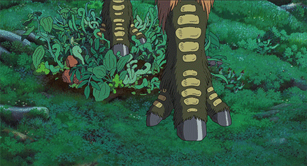
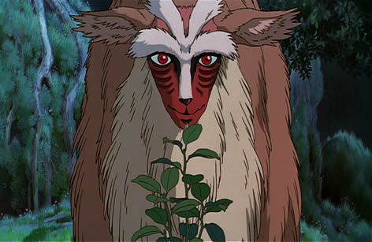

# Steps of the Forest God

## What

This project was started as a way to play with Apple's new ARKit. We toyed around with some sample code earlier in the week, and over the weekend, decided to make something special. We watched some movies and one of them was Hayao Miyazaki's Princess Mononoke. During the movie, the Forest Sprit / God walks onto the forest floor and plants emerged from his steps. Thus, the idea for `steps of the forest god` was born.

## Why

ARKit is super cool and we wanted to try something brand new. Also wanted to attempt to make something holistic, end-to-end. We created the game, the music, the interactions, and tried hard to make the 3D assets, but got those off the shelf (s/o PolyDust https://www.polydust.com) for the free assets :)

## How

* To run this project, you will need iOS11
* To compile this project, you will need XCode 9 beta 4.

Import the project into XCode, change the project settings to your team, and voila! You are now the Forest God.

## Who

This project was created by Wilhelm Willie (@wilhelmwillie) and Ramzi Abdoch (@rmzi). We created it just hacking and chillin' over the 7/29/17 - 7/31/17 weekend.

Special s/o to Thomas Sanderson and Alex Struck for kickin' it with us while we made this.

~ V A L U E T R A P ~

